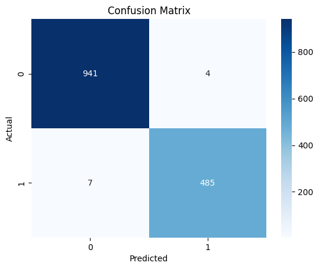

# Zomato Data Analysis

This repository contains an analysis of Zomato's dataset using Python and Jupyter Notebooks. The main focus is on exploring various aspects of the data, such as restaurant ratings, locations, cuisines, and pricing. The project includes data cleaning, exploratory data analysis (EDA), and visualizations to uncover trends in the restaurant industry.

## Data Description  
Contains more than 10,000 records of restaurants' in Sydney in the year 2018. 
| Column          | Description                                                  | Example                                      |
|-----------------|--------------------------------------------------------------|----------------------------------------------|
| 'address'       | Restaurant's address (text)                                  | 371A Pitt Street, CBD, Sydney                |
| 'cost'          | Average cost for two people in AUD (numeric)                | 50.0                                         |
| 'cuisine'       | Cuisines served by the restaurant (list)                    | [Thai, Salad]                                |
| 'lat'           | Latitude (numeric)                                          | -33.876059                                   |
| 'link'          | URL (text)                                                  | [https://www.zomato.com/sydney/sydney-madang-cbd](https://www.zomato.com/sydney/sydney-madang-cbd) |
| 'lng'           | Longitude (numeric)                                         | 151.207605                                   |
| 'phone'         | Phone number (numeric)                                      | 02 8318 0406                                |
| 'rating_number' | Restaurant rating (numeric)                                 | 4.0                                          |
| 'rating_text'   | Restaurant rating (text)                                    | Very Good                                    |
| 'subzone'       | Suburb in which the restaurant resides (text)               | CBD                                          |
| 'title'         | Restaurant's name (text)                                    | Sydney Madang                                |
| 'type'          | Business type (list)                                        | [Casual Dining]                              |
| 'votes'         | Number of users who provided the rating (numeric)           | 1311.0                                       |
| 'groupon'       | Is the restaurant promoting itself on Groupon.com? (boolean) | False                                        |

## Features
- Data Import & Cleaning
- Descriptive Statistics
- Exploratory Data Analysis with visualizations (histograms, bar charts)
- Handling missing values and outliers

## Getting Started
To run the analysis, clone the repository and open the Jupyter Notebook.

## Installation
```bash
git clone https://github.com/bilalazam-ds/zomato-data-analysis.git
cd zomato-data-analysis
```

## Requirements
    - Python 3.x
    - Pandas
    - Matplotlib
    - Seaborn
    - Jupyter Notebook

## Usage
Open the Jupyter Notebook parta.ipynb to explore the Zomato data and follow along with the analysis steps.
Open the Jupyter Notebook partb.ipynb to explore the Linear Regression and Classification.

## Confusion Matrix

